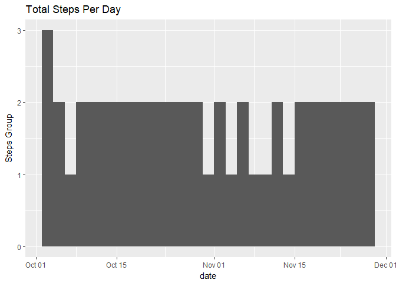
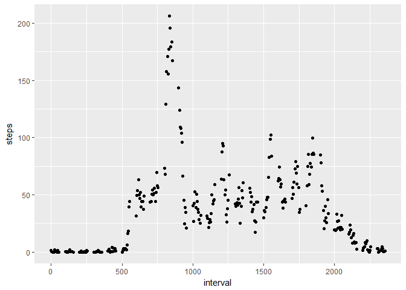
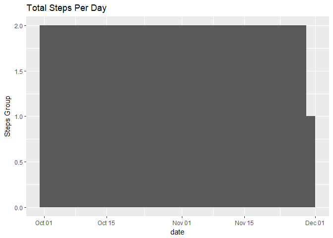
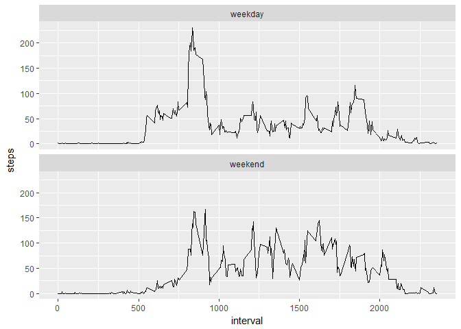

# Reproducible Research: Peer Assessment 1


## Loading and preprocessing the data

The data is extracted from the zip and loaded into memory with appropriate data types


```r
unzip("activity.zip", "activity.csv")
stepdata <- read.table("activity.csv", sep = ",", header = TRUE, na.strings = "NA", 
                       colClasses = c("integer", "Date", "integer"))
```

## What is mean total number of steps taken per day?

Calculate the total number of steps taken per day


```r
sums <- aggregate(steps ~ date, data = stepdata, sum)
```

Histogram of daily sums:


```r
library(ggplot2)
ggplot(sums, aes(date)) + 
  geom_histogram(binwidth = 2) + 
  ggtitle("Total Steps Per Day") + 
  ylab("Steps Group")
```

<!-- -->

Mean of steps per day:


```r
mean(sums$steps)
```

```
## [1] 10766.19
```

Median of steps per day:


```r
median(sums$steps)
```

```
## [1] 10765
```

## What is the average daily activity pattern?

Time series of the average steps taken per interval


```r
intervalavg <- aggregate(steps ~ interval, data = stepdata, mean)
ggplot(intervalavg, aes(interval, steps)) + 
  geom_line()
```

<!-- -->

This interval contains the maximum average number of steps:


```r
intervalavg[intervalavg$steps == max(intervalavg$steps), 1]
```

```
## [1] 835
```

## Imputing missing values

The data contains this many records with missing values:


```r
sum(is.na(stepdata$steps))
```

```
## [1] 2304
```

If the median for the interval is used to impute the missing values, we will see how the interpretation of the data changes:


```r
stepdataimp <- stepdata
for(i in 1:nrow(stepdataimp))
  {
  if(is.na(stepdataimp[i, 1]))
    {
    stepdataimp[i, 1] <- intervalavg[intervalavg$interval == stepdataimp[i, 3], 2]
    }
  }
```

Histogram of daily sums with imputation:


```r
sumsimp <- aggregate(steps ~ date, data = stepdataimp, sum)
ggplot(sumsimp, aes(date)) + 
  geom_histogram(binwidth = 2) + 
  ggtitle("Total Steps Per Day") + 
  ylab("Steps Group")
```

<!-- -->

Mean of steps per day with imputation:


```r
mean(sumsimp$steps)
```

```
## [1] 10766.19
```

Median of steps per day with imputation:


```r
median(sumsimp$steps)
```

```
## [1] 10766.19
```

The histogram output is drastically changed by imputing the missing values with the interval mean.
However, the daily median number of steps is not changed even though the daily median is made to match the mean.
By imputing the missing data, the way the data may be interpreted will be altered and may invalidate the findings.

## Are there differences in activity patterns between weekdays and weekends?

We add a column to the imputed data to distinguish weekdays and weekend days and use it to create an average of steps per interval and weekday type.


```r
stepdataimp$weekdaytype <- ""
for(i in 1:nrow(stepdataimp))
  {
  stepdataimp[i, 4] <- if(weekdays(stepdataimp[i, 2]) %in% c("Saturday", "Sunday"))
      {"weekend"}
    else
      {"weekday"}
  }
intervalavgdaytype <- aggregate(steps ~ interval + weekdaytype, data = stepdataimp, mean)
```

Then we can see how the average number of steps taken per interval is different on the weekend versus weekdays:


```r
ggplot(intervalavgdaytype, aes(interval, steps, weekdaytype)) + 
  geom_line() + 
  facet_wrap(~weekdaytype, nrow = 2)
```

<!-- -->
